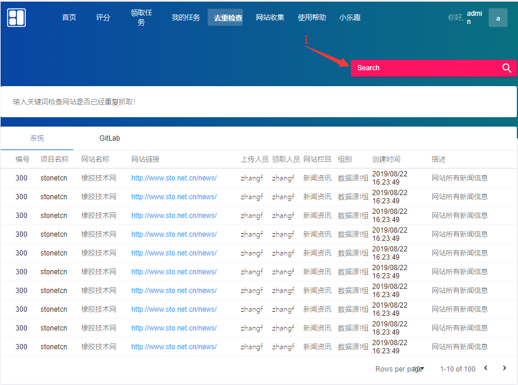

# 爬虫翻译工具使用帮助文档

## 系统简述

​ 任务分配系统主要服务于数据源组日常工作任务的安排，系统记录了每一位成员每一天工作情况。系统拥有爬虫任务登记、任务评分、任务领取、任务完成回馈以及网页收集的功能。

## 一.注册登录

### **1.首页界面**

### 2.注册界面

#### 注意事项：

- 在注册账号时,需要注意账号格式。（例如：李晓明(lixiaoming）ID:lixm）

## 二.首页（添加任务）操作

### 1.首页界面

​ 添加任务目的是将员工每日找到的网站，按照公司对**行业的分类**以及**信息类型分类**两方面将网站中信息分门别类的录入到系统中，是后续评分工作、任务分配、工作情况记录的重要前提条件。`

#### 1.1添加新项目

#### 相关功能：

1. 必须填写：网站名称*、*获取网站的人ID*、*gitlab项目名称*、*任务网站链接*、*任务网站爬取栏目*、*任务网站爬取栏目分数。

   选择填写：*选择组别*、*网站栏目描述* 等信息。

2. 点击保存按钮，若添加成功则再添加按钮下方出现《已添加：***》等信息，若添加有重复信息则在按钮下方出现《有重复：~~~》等信息；若输入有误，则弹出报错页面，请返回重新填写。

3. 若添加成功，在首页任务列表栏中会展示新添加的任务信息，请核对该条任务每一栏信息；若信息有问题，请及时联系组长并重新添加任务。

#### 注意事项：

- 务必将必填项全部填齐，在填写完成后核对一遍信息在提交，确保对应项都填写正确。
- 若此任务是组内任务，在可选栏中将小组名称选定；若任务为公开任务，***务必不可***选则小组！
- 网站栏目描述也就是针对该网站爬取栏目的描述，包含爬取内容、爬取难度等备注信息(为评分的人对该网站做出一个较为公正的评分)；

## 三.评分(爬取难度)操作

### 1.评分界面

​ 评分是小组每一位成员，每日**必须**要完成的任务。每一位成员每日必须完成对**6个及以上**网站的评分工作，以保证下周的任务量。

​ 评分标准:以个人对该网站数据的获取难易程度，数据的内容等多方面考虑。每个网站最终得分取得是多名成员评分总和的平均值

​ 评分目的:完成对已评分网站的数据爬取并产生数据集，那领取该任务的成员将获得此网站的分数，该分数将累计到自己的绩效中(**每人每周最少获得 500 分的基础分数**)。

#### 相关功能描述

1. 每一个小方块中，包含了网站爬取栏目的信息和网站链接，点击链接可直接查看原网页。
2. 可以拉动滑块或手动输入网站栏目评分(**值必须是0-100整数**)
3. 完成所有爬取栏目的评分工作后，点击提交所有评分按钮，将显示评分成功或失败界面。

## 四.领取任务操作

### 1.领取任务界面

#### 相关功能：

- 选择你所在的小组，选择了小组才可领取小组内任务。
- 点击领取按钮，将领取**该网站所有的爬取栏目的任务**，并且会在gitlab上创建该网站项目。

## 五.查看自己的任务

### 1.我的任务界面

​ 查看自己的任务主要是查看自己的任务完成情况，其中包含了 待爬取、正在爬取、爬取完成、爬取失败 四种任务状态列表；可以针对任务完成情况及时修改其任务信息状态。

#### 相关功能：

1. 领取任务后会在自己的任务（待爬取）列表中显示领取的任务列表，可以进行领取时间的排序。

2. 当完成某 `spider`任务后，可以点击 `状态监控 `中的 操作 按钮，进行修改爬取状态等信息。

3. 当完成某任务，修改其爬取状态，若选择 `爬取完成`则必须填写：原始数据集名称、数据表名称、清洗后数据集名称等信息。

4. 其它列表都可以按照`更新时间`等字段进行排序。

#### 注意事项：

- 每个spider更新时间周期为一周，`爬取完成`状态代表**数据集已经导出并清洗完成**；切勿将本周任务拖延到下周，否则任务（分数）将顺延到第二周；
- 网站崩溃或者网站禁止访问等情况出现，均属于爬取失败，该网站分数也将无法获得。
- 爬取完成的任务不可再修改：原始数据集名称、数据表名称、清洗后数据集名称等信息这些信息，否则将按照修改时间周的分数计算。
- 页面显示`周总分` `月总分`是时时瞬时产生，第二周、第二月将清零。

## 六.任务查找（查重）页

### 1.去重检查操作

​ 本页面主要用于当找到一个网站，不确定其他人是否已经爬取或录入了其网站；在此页面进行（模糊）搜索，可以针对都多出来的结果判断是否可以录入其网站任务。

#### 相关功能:

1. 搜索词可以填入项目名称、网站名称进行查重检查。
2. 搜索内容为本系统中的项目以及gitlab中的项目。

## 六.网站查找页

### 1.网页收集

​ 网站查找页主要用于代替人工去搜索引擎中搜索可用网站，此页可以输入关键词以及需要爬取的页数，去搜索关于填入关键词的网站，并记入系统中；然后再进行人工审核以及备注；搜索出的网站都会进行网站的排名以及浏览量等数据的获取。

#### 相关功能：

1. 填入搜索页数以及关键词（关键词不需要加“网”字，系统会默认附带“网”字进行搜索）。
2. 搜索结果可翻页查询。
3. 搜索结果可模糊查询。
4. 搜索结果可以进行修改备注等信息。

#### 注意事项：

- 当输入某关键词点击`添加搜索`按钮时，系统后台会定时的去爬取相关关键词，不需要重复填写点击。
- 一般搜索词产出数据都在一个小时至两个小时出现搜索结果；请耐心等待。

